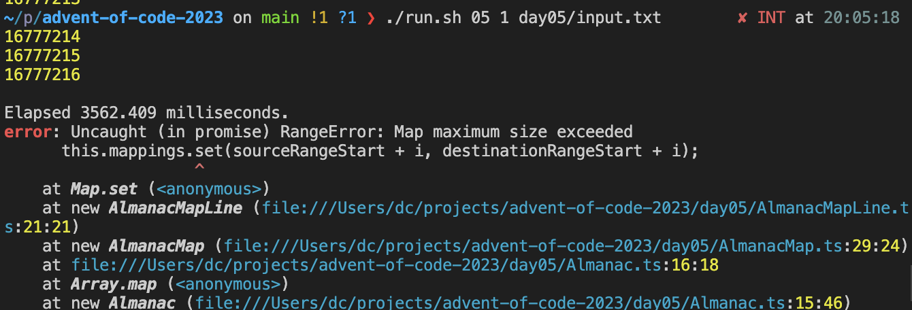
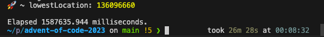

# Advent of Code 2023

https://adventofcode.com/2023/

## Run

```sh
./run.sh <day> <puzzle> <puzzle_input_file>

# example
./run.sh 02 1 day02/input.txt
```

## Things I want to explore

- [x] Deno minimal setup
- [x] https://docs.deno.com/runtime/manual/basics/debugging_your_code
- [ ] https://github.com/gvergnaud/ts-pattern#readme
- [ ] Deno tests
- [ ] https://github.com/sharkdp/hyperfine

## Deno

Deno manual: https://docs.deno.com/runtime/manual/

## Devember contract

> I, davcri, will participate to the next Devember.
> My devember will be tinkering with TS with
> Deno while solving Advent of Code puzzles.
> I promise I will program for my Devember for at least
> an hour, every day of the next December.
> I will also write a daily public devlog and will make
> the produced code publicly available on the internet.
> No matter what, I will keep my promise.

Devember: https://devember.org/rules/

My contract: https://twitter.com/dav__cri/status/1731364220728475748
https://twitter.com/dav__cri/status/1731364220728475748

## Devember devlog

### Day 01

The AoC puzzle for day 1 was quite tough, Hopefully I decided to use TS which is a
language that I use almost every day.

I decided to try the Deno runtime. I skimmed through the documentation and I'm not particularly
excited about [how it handles external
dependencies](https://docs.deno.com/runtime/tutorials/manage_dependencies), but I still need to try
it out. I spent some time setting up a small [Benchmark utility](./utils/) as
performance is becoming an obsession of mine.

### Day 02

The AoC day 2 puzzle was easier than day 1, luckily 😅. I also had the pleasure of pair programming
the first part with [rosepad21](https://github.com/rosepad21), a friend of mine. It was definitely
more enjoyable than doing it alone!

Having some extra energy I set up a [`PuzzleRunnerHelper`](./utils/puzzle-runner-helper.ts) to clean
up the `puzzle.ts` scripts from unnecessary noise.

### Day 03

The AoC puzzle took me some time but it was fun. Matrices are always interesting.

In terms of dev utilities, I set up the [Deno
debugger](https://docs.deno.com/runtime/manual/basics/debugging_your_code) on VSCode, which helped
me a lot.

### Day 04

I'm so glad I setup the debugger. Even if puzzles are still on the easy side, it helps a lot
to find trivial mistakes.

Regarding the solution I'm not completely satisfied as puzzle 2 takes 1800ms to compute on a M1 chip,
definitely too much time.

[UPDATE]: going from 1795ms to 170ms by memoizing one function.


I'm pretty sure there's still room for improvement as `cardNumbers` could be refactored to be a
`Set<number>` instead of an `array[number]`, however this is already a big improvement.

### Day 05

OMG I can't spend 3 hours a day on the AoC... However I found out the maximum size of a
Map in Deno (16777216):



Clearly I relied too much on OOP abstractions: storing every range value in a map is a bad idea.
Unfortunately I didn't look at the problem input which had big numbers and completely destroyed my
first implementation.

Regarding puzzle 2, well it took 26 minutes:



### Day 06

The puzzle was easier than the other days so I took a different approach to [input
parsing](https://github.com/davcri/advent-of-code-2023/blob/main/day06/puzzle.ts#L6). It's probably
silly to not use `.split()` and similar utilities, but it was a fun mental exercise.
